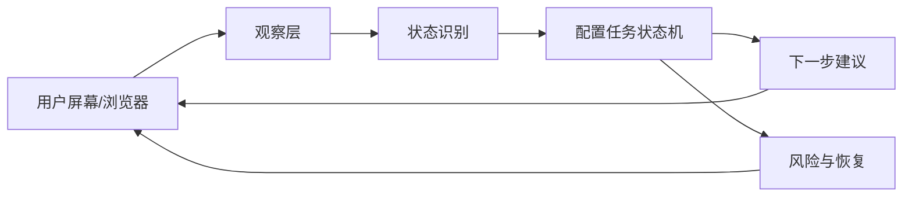

# 配置陪跑 Agent MVP

## 目标

让没有技术基础的用户在配置、部署、授权、安装工具时，不需要先理解完整技术栈。Agent 负责观察当前状态、拆出下一步、提醒风险、验证结果，并在失败时给出恢复路径。

## MVP 范围

- 选择配置任务：托管 AI、本地开发、上线域名。
- 每个任务拆成 3 个可验证节点。
- 每个节点包含：观察状态、下一步动作、风险提醒、验证标准。
- 用户可以点击“开始观察”“我完成了”“我卡住了”，也可以描述当前页面或报错。
- 当前实现是前端交互原型，屏幕观察使用模拟状态。

## 真实接入架构



## 观察层

可选实现：

- 浏览器扩展：读取当前标签页 URL、标题、DOM 文本、表单状态和错误提示。
- 桌面助手：在用户授权后读取屏幕截图，识别当前应用、弹窗、按钮和报错。
- Codex/Computer Use 模式：由用户明确要求后临时观察并指导，不做后台常驻监控。

## 安全边界

- 不读取、不存储、不复述完整密码、验证码、API Key、支付信息。
- 涉及密钥或授权时，只提醒用户在哪里填写、如何验证，不替用户泄露内容。
- 高风险操作前必须要求用户确认，例如删除资源、重置环境、修改 DNS、提交付款。
- 所有观察都需要用户显式开启，可暂停，可清空。

## 状态接口草案

```ts
type CoachCheckpoint = {
  title: string;
  observed: string;
  nextAction: string;
  risk: string;
  verify: string;
};

type ScreenObservation = {
  source: "browser" | "desktop" | "manual";
  url?: string;
  title?: string;
  visibleText: string[];
  errorText: string[];
  sensitiveFieldsDetected: boolean;
};
```

## 下一步

1. 把当前 React 原型接入真实配置清单数据。
2. 为 CloudBase、DNS、Vite 本地开发分别补充详细状态规则。
3. 接入浏览器观察能力，先做只读识别，不做自动点击。
4. 增加“导出配置复盘”，把成功步骤、失败原因和最终验证结果保存为清单。
